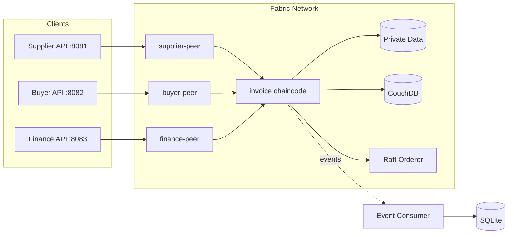
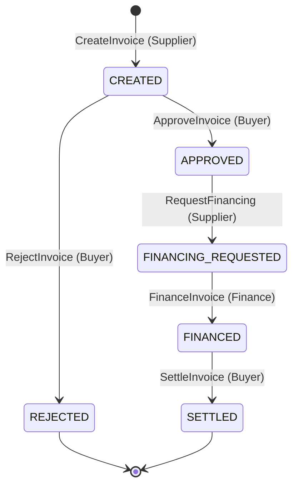

# FinTrust

A confidential B2B invoice financing network built on Hyperledger Fabric. FinTrust demonstrates multi-party invoice approval, financing, and settlement while keeping commercial and financing terms private to authorized parties.

## Why FinTrust

Invoice financing involves suppliers, buyers, and financiers who must coordinate invoice validity and financing decisions without exposing confidential data to each other. FinTrust addresses this with Fabric's private data collections: the supplier and buyer share commercial terms privately, while the supplier and financier share financing terms separately. The shared ledger enforces a strict invoice lifecycle and prevents double-financing through state-based endorsement, while chaincode events enable off-chain projections for efficient querying.

## Architecture



Each organization runs its own API backed by a Fabric Gateway connection to its peer. Private data is submitted via transient fields and stored in organization-scoped collections. The local development topology uses a single Raft orderer; production deployments would use multiple orderers across organizations.

## Trust Model

The network comprises three organizations:

- **SupplierMSP**: Creates invoices, requests financing, receives payment
- **BuyerMSP**: Approves invoices, settles payments
- **FinanceMSP**: Provides financing against approved invoices

All chaincode authorization is based on the caller's Fabric identity (MSP ID), not request-supplied fields. Client identities are non-admin application users enrolled via Fabric CA.

## Invoice Lifecycle



Each transition enforces that only the authorized organization can invoke it. Terminal states (REJECTED, SETTLED) cannot be modified.

## Confidentiality

**Public data** (visible to all channel members):
- Invoice ID, supplier/buyer MSP IDs
- Document hash, status, timestamps
- Financing flag (financed: true/false)

**Supplier + Buyer private collection** (`collectionInvoiceParties`):
- Commercial terms (amount, currency, payment terms)
- Payment details (bank account, routing)

**Supplier + Finance private collection** (`collectionSupplierFinance`):
- Financing request (requested amount, tenor)
- Disbursement details
- Financing agreement (financed amount, discount)

Private data is submitted via Fabric transient fields, never logged or committed to public state.

## Endorsement Model

State-based endorsement (SBE) restricts which organizations can modify an invoice at each lifecycle phase:

| Phase | Required Endorsers |
|-------|-------------------|
| CREATED | SupplierMSP + BuyerMSP |
| APPROVED / FINANCING_REQUESTED | SupplierMSP + FinanceMSP |
| FINANCED | BuyerMSP + FinanceMSP |

When `FinanceInvoice` commits, it rotates the endorsement policy to require Buyer + Finance for settlement. This rotation is the mechanism that prevents double-financing.

## Concurrency Correctness

### Concurrent FinanceInvoice

Two concurrent `FinanceInvoice` proposals may both endorse successfully against the pre-financing state. However, when the first transaction commits, it rotates the invoice's SBE policy. The second proposal's endorsements become invalid:

- First: commits VALID
- Second: **ENDORSEMENT_POLICY_FAILURE** (SBE changed)

### Concurrent RequestFinancing

Two concurrent `RequestFinancing` proposals against the same APPROVED invoice will both read the same version. When the first commits:

- First: commits VALID
- Second: **MVCC_READ_CONFLICT** (stale read set)

The E2E test suite (`make verify-e2e`) explicitly verifies both failure modes.

## Event Projection

The API subscribes to Fabric chaincode events and projects them into SQLite for efficient querying.

**Checkpoint behavior:**
- Checkpoint is stored durably after each block
- On restart, replay begins from the checkpoint block
- `(transaction_id, event_name)` uniqueness prevents duplicates
- This ensures no events are lost if the consumer crashes mid-block

**Projected events:** InvoiceCreated, InvoiceApproved, InvoiceRejected, FinancingRequested, InvoiceFinanced, InvoiceSettled

The `make verify-api` target includes a checkpoint restart test that stops the consumer, commits transactions while offline, restarts, and verifies catch-up without duplicates.

## Quick Start

**Prerequisites:**
- Docker and Docker Compose
- Go 1.26.4+
- Fabric CLI binaries: `peer`, `configtxgen`, `osnadmin`, `fabric-ca-client`
- `jq`, `openssl`

**Versions:** Fabric 2.5.16, Fabric CA 1.5.22, CouchDB 3.4.2

**Run the demo:**

```bash
make demo
```

This starts the network, deploys chaincode, runs APIs, and demonstrates:
- Full invoice lifecycle (Create → Approve → Request → Finance → Settle)
- Private data access control
- Double-financing prevention
- Event projection

**Advanced verification:**

```bash
make check       # Static checks, unit tests, formatting
make verify-e2e  # Full E2E security and concurrency tests
make verify-api  # API verification with checkpoint restart test
```

## API

Each organization runs its API on a separate port (Supplier: 8081, Buyer: 8082, Finance: 8083).

| Method | Endpoint | Description |
|--------|----------|-------------|
| GET | /healthz | Health check |
| POST | /api/v1/invoices | Create invoice (Supplier) |
| GET | /api/v1/invoices?status=X | Query by status |
| GET | /api/v1/invoices/{id} | Get public invoice |
| GET | /api/v1/invoices/{id}/private | Get private commercial data |
| GET | /api/v1/invoices/{id}/financing | Get financing terms |
| GET | /api/v1/invoices/{id}/events | Get invoice events |
| POST | /api/v1/invoices/{id}/approve | Approve (Buyer) |
| POST | /api/v1/invoices/{id}/reject | Reject (Buyer) |
| POST | /api/v1/invoices/{id}/financing-request | Request financing (Supplier) |
| POST | /api/v1/invoices/{id}/finance | Finance (Finance) |
| POST | /api/v1/invoices/{id}/settle | Settle (Buyer) |
| GET | /api/v1/events | Query event projection |

## Testing

**Test layers:**
- Chaincode unit tests: state machine, authorization, validation
- E2E integration tests: network-level security and concurrency
- Backend unit tests: API routing, projection store, checkpointing
- API runtime verification: HTTP lifecycle, checkpoint restart

**Security coverage:**
- Unauthorized organization rejection
- Invalid lifecycle transitions
- Private data isolation between parties
- Public block privacy (no transient data leakage)
- Sequential double-financing prevention
- SBE concurrent single-winner verification
- MVCC read conflict detection
- Checkpoint recovery and idempotent replay

## Project Scope

This project intentionally does not include:
- Payment processing or settlement execution
- Tokens or cryptocurrency
- Multi-channel architecture
- Kubernetes or cloud deployment manifests
- Enterprise SSO or external identity providers
- Web frontend

These are out of scope to keep the project focused on demonstrating Fabric's confidential multi-party workflow capabilities.

## License

Apache License 2.0
